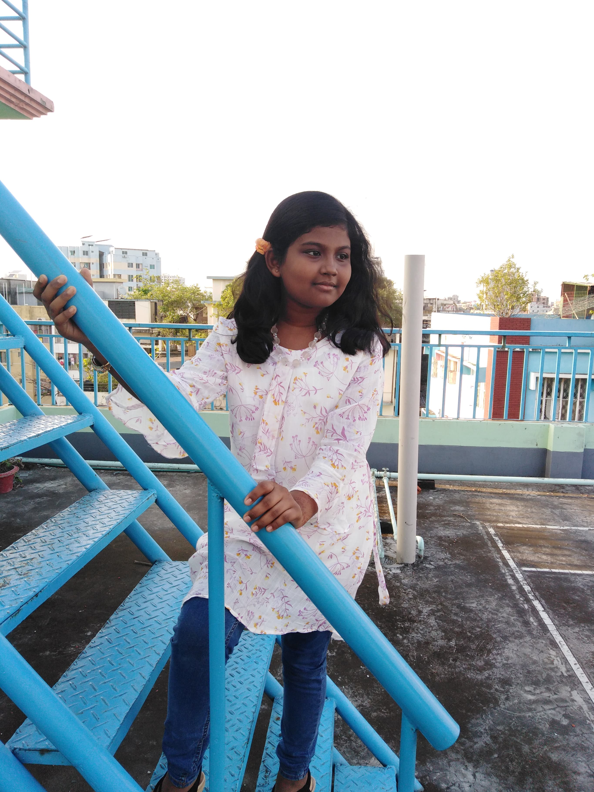
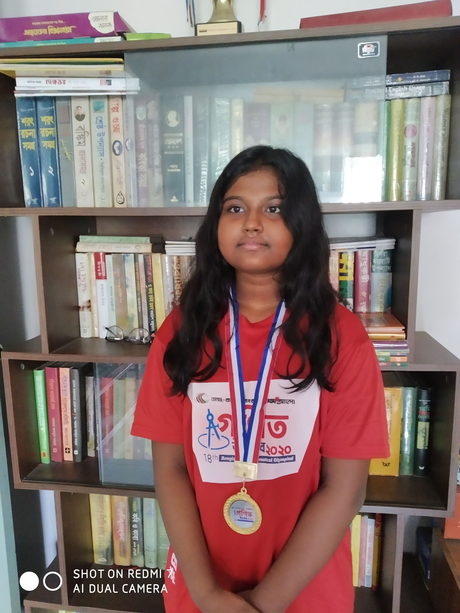

<!DOCTYPE html>
<html>
    <head>
        <title> Monamy Zaman Website </title>
                   
    </head>
    <body>
        <section class="container">
            

                 <h1> Welcome to  Monamy Zaman  world! </h1>
                 <h3> Student and Programmer </h3>
                 
I am in class 7. I read in <em>Viqarunnisa Noon School. </em>I am learning programming and web development. 

                 <a class="primary-btn" href="https://www.khanacademy.org/profile/Dorothy88888888/"> My Khan Academy profile. </a>
            

            
 
                  </img> 
            

        </section>
        <section class="container">  
            

                   </img>
            

            
  
                <h2> BIG DREAM </h2>
                <h4> Becoming a web developer. </h4>
                
 I already learned basic HTML and CSS.I can create a simple website.I also know the fundamentals of <em> Python. </em> My goal is to make a simple game for my brother so I can get him interested in programming. <strong> I really need a partner! </strong> 

                <a class="primary-btn" href="#"> Email:Shamima20052015@gmail.com </a>
            

        </section>
        <section class="container experiences"> 
            <h2> Experience </h2>
            
 
                <h3> Mathmetician </h3>
                
 Winning the regional round of <strong> BDMO 2020.</strong> 

                
 I know a good amount of algebra. I can solve linear systems of equations and inequalities. I also understand functions. I am learning more and more everyday.  

                <h3> Scientist </h3>
                
 Winning the regional round of <strong> BDJSO 2021. </strong> 

                
 I know a little simple science. I often spend my time doing silly scientific experiments. 

                <h3> Linguistic </h3>
                
 Fluent in 3 languages. 

                
 I know 3 languages including our mother language বাংলা(Bengali). The other two are English and French. 

            

        </section>
    </body> 
    <footer>  
    
 © Monamy Zaman 2008, A programming hero initiative. 

    </footer>
</html>
